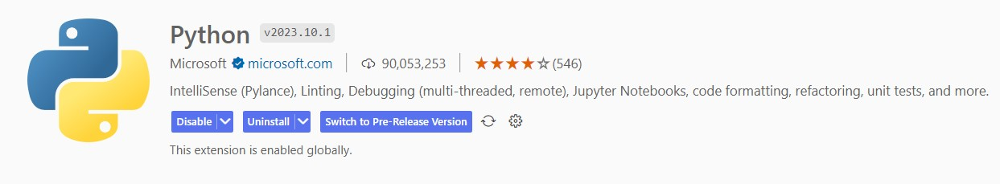

[toc]

# 环境 Environment

## Anaconda

[Anaconda](https://www.anaconda.com/)
[Anaconda 清华大学镜像](https://mirrors.tuna.tsinghua.edu.cn/anaconda/archive/)

- conda 创建环境

        conda create -n xx python=xx

- conda 删除环境

        conda remove -n xx --all

- conda 安装 package

        conda install xx

- conda 清除缓存

        conda clean --all

## CUDA 和 cuDNN

## Tensorflow

[Tensorflow](https://tensorflow.google.cn/?hl=zh-cn)

- 安装 tensorflow

        pip install tensorflow

- 验证 tensorflow 安装

        import tensorflow as tf

        print(tf.__version__)

- 验证 GPU

        import tensorflow as tf

        print(tf.test.is_gpu_available())

## Pytorch

[Pytorch](https://pytorch.org/)

- 安装 pytorch cpu 版本

        pip3 install torch torchvision torchaudio

- 安装 pytorch gpu 版本（11.7）

        pip3 install torch torchvision torchaudio --index-url https://download.pytorch.org/whl/cu117

- 验证 pytorch 安装

        import torch

        print(torch.__version__)

- 验证 GPU

        import torch

        print(torch.cuda.is_available())

## Editor

[Visual Studio Code](https://code.visualstudio.com/)

VS code Python 插件

VS code Jupyter 插件

